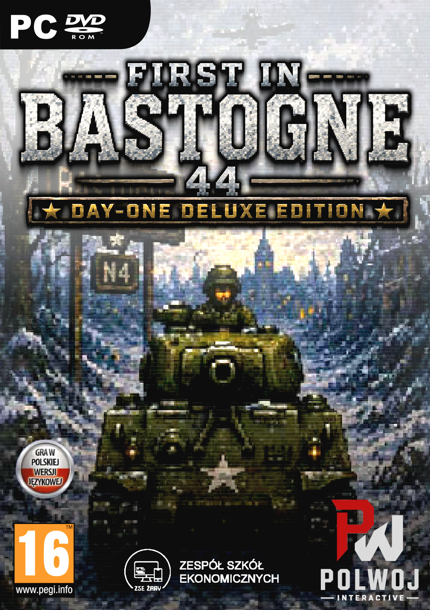

# First in Bastogne 44

  <strong>Aby zagrać w najnowszą wersję gry, wejdź w sekcję <a href="../../releases">Releases</a> i uruchom instalator z najnowszego wydania.</strong>

## O Grze

**First in Bastogne** to fabularna gra akcji 2D osadzona podczas zimowej ofensywy w Ardenach. Gracz obejmuje dowództwo nad słynnym czołgiem **Cobra King** i bierze udział w desperackiej drodze ku Bastogne, przejeżdza przez wiele miast i wsi oraz walczy z różnymi typami wrogów.

Zostań dowódcą stalowej maszyny, przebijaj się przez zasypane śniegiem drogi, odpieraj niemieckie natarcia i wykorzystuj uzbrojenie czołgu do walki z piechotą, pojazdami oraz ostrzałem artyleryjskim. Gra łączy klimat retro pixel-artu z dynamiczną walką, sekwencjami fabularnymi, dialogami i kampanią prowadzącą przez kolejne etapy operacji.

### Co Cię Czeka

- kampania odwzorująca bitwą o Bastogne i zimową ofensywą 1944 roku,
- sterowanie czołgiem Cobra King w czasie rzeczywistym,
- walka z piechotą, pojazdami pancernymi i ostrzałem obszarowym,
- główne działo, karabin maszynowy, efekty eksplozji i zniszczeń,
- sceny fabularne, dialogi i przejścia między poziomami,
- oprawa retro z pikselową typografią i wojenną atmosferą.

## Wymagania Sprzętowe

| Komponent | Minimalne | Zalecane |
| --- | --- | --- |
| CPU | Intel Core i5-11400F / AMD Ryzen 5 5500 | Intel Core i5-12600K / AMD Ryzen 5 7600 |
| GPU | Nvidia GeForce GTX 1050 Ti / AMD Radeon RX 570 4 GB | Nvidia GeForce RTX 2060 / AMD Radeon RX 5600 XT |
| RAM | 8 GB | 16 GB |
| Miejsce na dysku | 500 MB | 1,5 GB |
| System | Windows 10 64-bit | Windows 11 64-bit |

## Instalacja

1. Przejdź do zakładki **Releases**.
2. Pobierz najnowszy instalator gry.
3. Uruchom instalator i postępuj zgodnie z instrukcjami.
4. Włącz grę i rozpocznij drogę do Bastogne.

## Okładka Limitowanego Wydania Fizycznego

